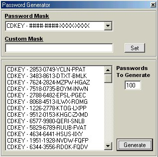



## A\+\+ PASSWORD GENERATOR WITH MASKS\(Like in Auto Play Menu Studio\) \(UPDATED\)

### Description

(BY REQUEST IT NOW PRODUCES ONLY UNIQUE PASSWORDS. ENJOY IT!!) This will create passwords any number of passwords you want with any mask. You can also create custom masks! Very simple and little code. Easily customizable. MUST SEE! If you like it please vote and leave feedback.
 
### More Info
 

             |
---                |---
**Submitted On**   |2002-04-11 16:21:16
**By**             |[James Dougherty](https://github.com/Planet-Source-Code/PSCIndex/blob/master/ByAuthor/james-dougherty.md)
**Level**          |Intermediate
**User Rating**    |4.9 (34 globes from 7 users)
**Compatibility**  |VB 6\.0
**Category**       |[Miscellaneous](https://github.com/Planet-Source-Code/PSCIndex/blob/master/ByCategory/miscellaneous__1-1.md)
**World**          |[Visual Basic](https://github.com/Planet-Source-Code/PSCIndex/blob/master/ByWorld/visual-basic.md)
**Archive File**   |[A\+\+\_PASSWO710914112002\.zip](https://github.com/Planet-Source-Code/james-dougherty-a-password-generator-with-masks-like-in-auto-play-menu-studio-updated__1-33693/archive/master.zip)

